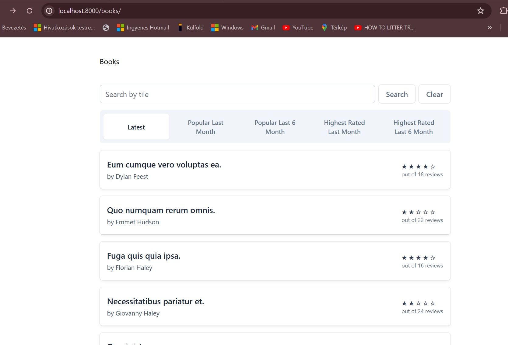

# Laravel 10 Book Review

## Table of contents
* [General info](#general-info)
* [Description](#description)
* [Screenshot](#screenshot)
* [Technologies](#technologies)
* [Setup](#setup)
* [Documentation](#documentation)
* [Created](#created)

## General info

Book Review application built with Laravel 10, providing a simple interface to seed and manage book reviews efficiently for [Master Laravel for Beginners & Intermediate 2024 Udemy Course](https://www.udemy.com/course/laravel-beginner-fundamentals/learn/lecture/38206614#content).

## Description

The Book Review application allows users to create, view, and manage reviews for various books. Books can be queried based on the following criteria:

- Latest
- Popular Last Month
- Popular Last 6 Months
- Highest Rated Last Month
- Highest Rated Last 6 Months

## Screenshot



## Technologies

+ Laravel 10
+ PHP 8
+ MySQL
+ Tailwind
+ Docker
+ Blade Templates
+ Adminer DB management

## Setup

Clone the repository:

```bash
git clone git@github.com:ivorszaniszlo/book-review
```

Navigate to the project directory:

```bash
cd book-review
```

Install dependencies:

```bash
composer install
npm install
```

Set up environment variables:

```bash
cp .env.example .env
php artisan key:generate
```

Set up the database and run migrations:

```bash
php artisan migrate
```

Serve the application:

```bash
php artisan serve
```

### Docker Setup

Build and run the Docker containers:

```bash
docker-compose up --build
```

Access the application at `http://localhost:8000`.

## Documentation

Documentation is available in the `docs` directory.

## Created

2024
